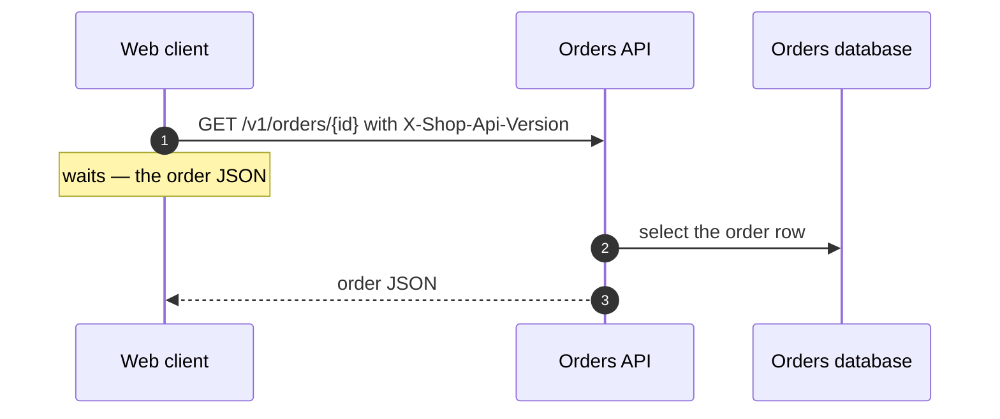

# Flows — who waits for what

> Generated by `crossweft render` from [`seams/model`](model/). Do not edit this file by hand: change the model and render again. Checked against the code by `crossweft check`.

Each flow is a sequence of steps over the links of the map. Every step says who calls whom, what the caller waits for and what happens next.

## Read an order

The web client shows an order the API loads from the database.

- status: **current**

| # | Who -> whom | Action | Waits | Then |
|---|---|---|---|---|
| 1 | [Web client](blocks.md#web) → [Orders API](blocks.md#api) HTTPS | GET /v1/orders/{id} with X-Shop-Api-Version | the order JSON |  |
| 2 | [Orders API](blocks.md#api) → [Orders database](blocks.md#orders-db) SQL | select the order row |  |  |
| 3 | [Orders API](blocks.md#api) → [Web client](blocks.md#web) HTTPS | order JSON |  |  |
