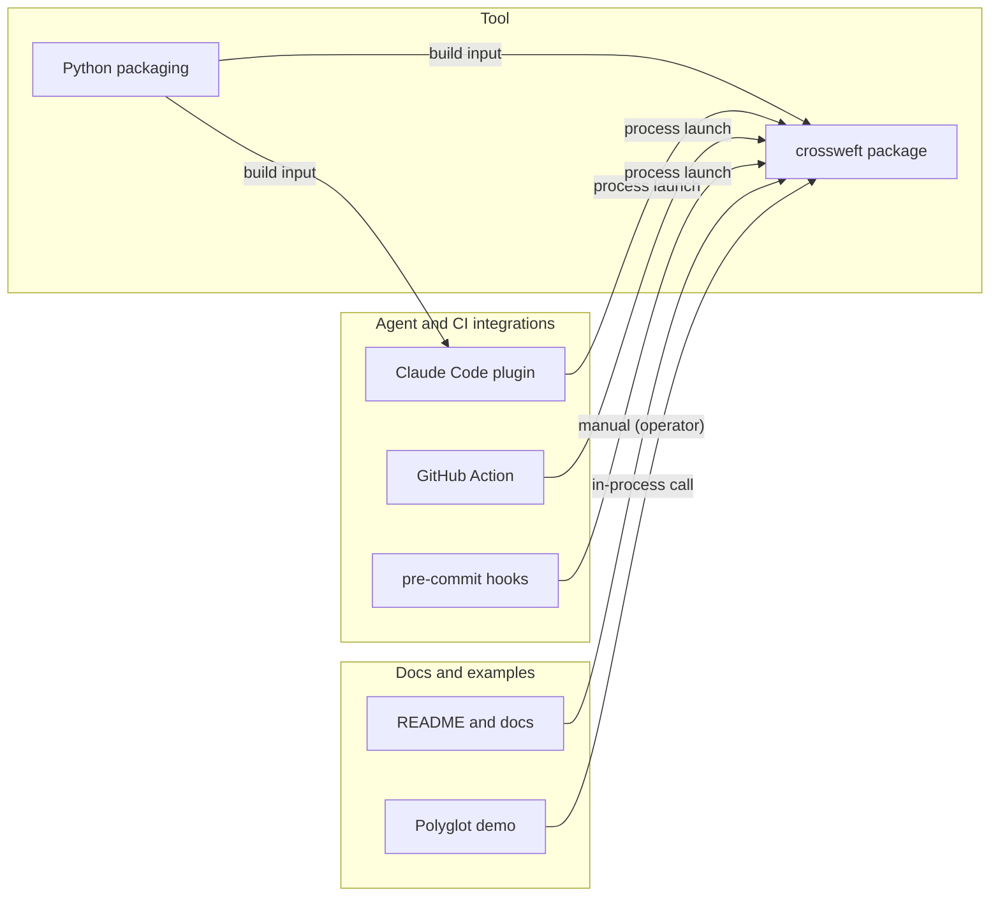

# crossweft — its own seams

> Generated by `crossweft render` from [`seams/model`](model/). Do not edit this file by hand: change the model and render again. Checked against the code by `crossweft check`.

The map answers four questions: **which blocks exist**, **who talks to whom and how**, **who waits for what** and **where each piece of data comes from**. Everything is written once in the model and checked against the code, so mismatches are found automatically.

- **[Interactive map](viewer.html)** — open `viewer.html` in a browser: click a block to see its links, waits and data.
- [Blocks](blocks.md) · [Flows — who waits for what](flows.md) · [Data — where it comes from](data.md) · [Findings](findings.md)

## How to read

| Term | Meaning |
|---|---|
| Block | A program, service, component, store, external service or build tool. A block lives in a lane and has a status. |
| Link | Who passes what to whom: the transport (pipe, HTTPS, file, generated code...), the contract and where it is defined, what the caller waits for, what happens on error. |
| Flow | Ordered steps over links: who calls whom and what each step waits for. |
| Data | Keys, receipts, payloads, states: who creates them, which links carry them, where they are stored, where the format is defined. |
| Finding | A recorded mismatch between two sides, the code or the docs. Each has an owner and a next step. |
| Link contract | How the two sides of a link stay in agreement: one owner (`shared-code`, `generated`, `schema-tests` — named in `defined_in`) or hand-written on both sides (`duplicated`, `convention`, `none`) — then a join, set or pair must read both sides, or a change to one side silently leaves the other behind. |

Statuses: **current** (`current`), **planned** (`planned`), **out of scope** (`out-of-scope`), **test only** (`test-only`), **legacy** (`legacy`). Evidence: `none` — not proven, `source` — source, `ci` — CI, `runtime` — installed product.

## Overview

## Blocks by lane

| Lane | Block | What it does | Talks to |
|---|---|---|---|
| Tool | [crossweft package](blocks.md#engine) | Engine, CLI, discover, agent hooks, validators runner. | [Claude Code plugin](blocks.md#claude-plugin), [Polyglot demo](blocks.md#demo), [README and docs](blocks.md#docs), [GitHub Action](blocks.md#github-action), [Python packaging](blocks.md#packaging), [pre-commit hooks](blocks.md#pre-commit) |
| Tool | [Python packaging](blocks.md#packaging) | pyproject.toml: the pip package and the console script. | [Claude Code plugin](blocks.md#claude-plugin), [crossweft package](blocks.md#engine) |
| Agent and CI integrations | [Claude Code plugin](blocks.md#claude-plugin) | Manifest, marketplace entry, hooks, launcher and skill. | [crossweft package](blocks.md#engine), [Python packaging](blocks.md#packaging) |
| Agent and CI integrations | [GitHub Action](blocks.md#github-action) | Composite action that annotates the diff. | [crossweft package](blocks.md#engine) |
| Agent and CI integrations | [pre-commit hooks](blocks.md#pre-commit) | Hook definitions for the pre-commit framework. | [crossweft package](blocks.md#engine) |
| Docs and examples | [README and docs](blocks.md#docs) | What people read before they run anything. | [crossweft package](blocks.md#engine) |
| Docs and examples | [Polyglot demo](blocks.md#demo) | Go + TypeScript + Python shop; the tests break each seam. | [crossweft package](blocks.md#engine) |

## Flows — who waits for what

## Findings

Open or accepted: **0** (closed: 0). Full register with evidence: [findings.md](findings.md).

| ID | Severity | Status | Summary | Next step | Owner |
|---|---|---|---|---|---|

## How to update the map

1. You change a seam in code (a route, pipe, contract, file, key) — in the same change, update the matching `seams/model/*.json` (block, link, data or flow).
2. Before committing, run `crossweft impact` (or `crossweft impact --base origin/main` for a whole branch): which links run through the changed files, where the other side of each is, and what guards it. Re-read the other side of every touched seam.
3. `crossweft check` verifies code anchors, values on both sides, routes, data provenance, seam contracts, statuses and the findings register.
4. `crossweft render` regenerates these pages and `viewer.html`.
5. Found a mismatch you cannot fix now? Record a finding with an owner, a next step and the detector key; when it is fixed, the check itself asks you to close the record.
6. `crossweft show <id>` prints one block, link or data item with its neighbours.

Model: 7 blocks, 7 links, 0 flows, 0 data items, 2 value guards, 4 set guards, 0 paired regions, 0 findings.

Contracts of current links: `duplicated` 3, `convention` 3, `compiler` 1 (`compiler` — a call inside one binary; `--` — the link has no second side in our code).
